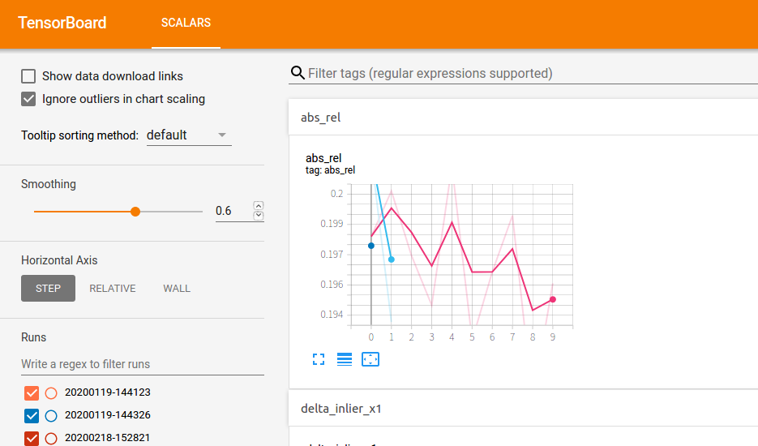

# Depth Estimation Project

This is the depth estimation project, I implemented a relatively robust baseline and trained this model with around 300k pano-depth pairs on a muti-GPU server. With some optimization, this approach could infer depth map with a decent accuracy as well as efficiency, which is approximately 2 second per inference in modern mobile devices. 

## Requirments

Python >=3.6
opencv-python = 3.4.2
tqdm =  4.36.1 
numpy = 1.17.2
tensorflow >=2.0

or refer to  `environment.yaml` for some other dependencies.
## Project Location

`/media/evan/6cda00cb-e39e-4433-8097-8af7c91757a7/home/limchaos/PycharmProjects/Depth_TF`

## Dataset 

A small subset can be found in `/media/evan/D4655C7F24C90A64/scene_data/space_data`, full dataset was dumped in the muti-GPU server. The structure of dataset shows as below:

```
<dataset directory with uuid>
         ├── depth
         ├── obj
         ├── pose
         ├── pan
              ├── high
              ├── low
              ├── images
         ├── "others"

```

## How to train
**1.** First, generate `training list` and  `validation list` by using `generate_csv.ipynb`, simply have a glance, you will know how to use that scrip. You could also modify `dataset.py` to load data by your own approach.

**2.** Config part can be found in `train.py`. Modify path to your newly generated `.csv` format file, you could use tensorboard to check training log under `logdir` , `rate` is loss weight among **L1 Loss, Normal Loss and SSIM Loss**, `ssim_k` is the kernel size of **SSIM Loss**.
 
 
=
**3.** After finish training configuration, run:

`python train.py`

some visualization results would be dumped together with training checkpoints, you could also add more visualization methods if necessary, visualized images can always help to add new ideas.

|** RGB Image**    |**Depth Map**|
|---------------------|---------------------|
| |   |

|**Normal Map**| **Error Map**|
|---------------------|---------------------|
| |  |

|**Point Cloud**| 
|---------------------|
||

**4.** Tensorboard Visualization, run `tensorboard --logdir [path to log dir]`


=
## How to test

Run:
`python infer.py  {path to your images path} {path to tflite}`

if you want to run inference  with vanilla `.ckpt` weights, please refer to `inference.py`

## Visualization
I did some  EDA in `pose_EDA.ipynb`, including **depth distribution, camera orientation and cameara motion**,  part of these figures was illustrated below.


=

=
## Converter
This part describe how to convert `.ckpt` format  weights to `.pb` format and  `.tflite` format, for C++ deployment and mobile devices deployment, respectively.

 
=

You need to modify the code to choose which mode you want to convert

converting model you need to refer to `converter.py`, `reload_id` is where you put your `.ckpt`file.

1. **.pb** format
Set `mode = pb`, and run `python converter.py`

2. **.tflite** format
Set `mode = tflite`, and run `python converter.py`, you could set `quantize = True ` to activate [**quantization**](https://tensorflow.google.cn/lite/performance/model_optimization).
## Further Research

I still think self-supervised approaches are worth to try. Like  [Digging Into Self-Supervised Monocular Depth Estimation](https://arxiv.org/pdf/1806.01260.pdf). Combining some MVS ideas with Deep Learning shoud also be a good try, some related work like [DeMoN: Depth and Motion Network for Learning Monocular Stereo](https://arxiv.org/pdf/1612.02401.pdf). I also attmpted to do some works in this direction, there are some draft in `corresponding.ipynb`,`bitrain.py` and `pose_train.py`. The idea is very simple, increase more constraints from two different views matching to reduce the searching space. Matching was caculated from depth map and camera localization. These data could also be used in other field, like features or camera relocaliztion.


=
