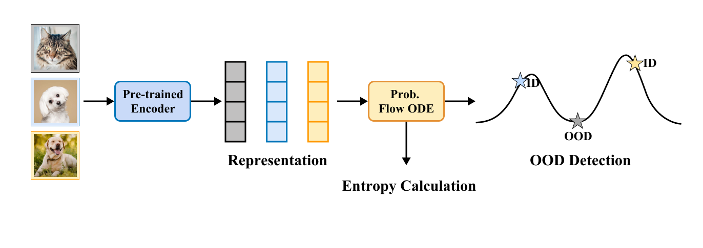

# Do Diffusion Models Know What They Don’t Know in Representation Space?

This is the pytorch implementation for RDM, a practical method for OOD detection using diffusion models applied to image representations.

<p align="center">
  
</p>

## Requirments

* Python >=3.7
* pytorch-cuda = 11.8
* scipy =  1.13.1 
* faiss-gpu = 1.8.2
* einops = 0.8.0
* torchdiffeq = 0.2.4

You can also use Anaconda

`conda env create -f environment.yaml `

to manage the enviroment.


## DataSets

Dataset source can be downloaded here, we use the same dataset as in VIM and GEN,

- [ImageNet](https://www.image-net.org/). The ILSVRC 2012 dataset as In-distribution (ID) dataset. The training subset we used is [this file](datalists/imagenet2012_train_random_200k.txt).
- [OpenImage-O](https://github.com/openimages/dataset/blob/main/READMEV3.md). The OpenImage-O dataset is a subset of the OpenImage-V3 testing set. The filelist is [here](datalists/openimage_o.txt).  
- [Texture](https://www.robots.ox.ac.uk/~vgg/data/dtd/). We rule out four classes that coincides with ImageNet. The filelist used in the paper is [here](datalists/texture.txt).
- [iNaturalist](https://arxiv.org/pdf/1707.06642.pdf). Follow the instructions in the [link](https://github.com/deeplearning-wisc/large_scale_ood) to prepare the iNaturalist OOD dataset.
- [ImageNet-O](https://github.com/hendrycks/natural-adv-examples). Follow the guide to download the ImageNet-O OOD dataset.

```bash
mkdir data
cd data
ln -s /path/to/imagenet imagenet
ln -s /path/to/openimage_o openimage_o
ln -s /path/to/texture texture
ln -s /path/to/inaturalist inaturalist
ln -s /path/to/imagenet_o imagenet_o
cd ..
```

## Pretrained Model Preparation

### Self-supervised encoder

For [DINO](https://github.com/facebookresearch/dino), [DINOv2](https://github.com/facebookresearch/dinov2) and [MAE](https://github.com/facebookresearch/mae), we use all the encoders from the official repo.

### Supervised encoder

For all supervised encoders, we refer to [VIM](https://github.com/haoqiwang/vim).

## Train

```bash 
export LR=2e-3 && export EPOCH=200 && WD=0 && DIR=output1

mkdir -p ./checkpoint/${DIR}/con
mkdir -p ./checkpoint/${DIR}/uncon

python run.py dinov2 ${LR} ${EPOCH} ${WD} imagenet2012_train_random_200k.pkl ${DIR} #-logit -norm
```
or check `train.sh`.

## Evaluate

```bash 
export DIR=output1
mkdir -p ./eval/${DIR}

python eval.py dinov2 ${DIR} #-logit -norm
```
or check `eval.sh`.

## TODO

- [x] Add 2d toy data training and visualization
- [x] Add histopathology data
- [x] Add code for arbitrary encoder 

## Acknowledgement

Part of the code is modified from [VIM](https://github.com/haoqiwang/vim), [RCG](https://github.com/LTH14/rcg) and [Score-Based Generative Modeling through Stochastic Differential Equations](https://github.com/yang-song/score_sde).
